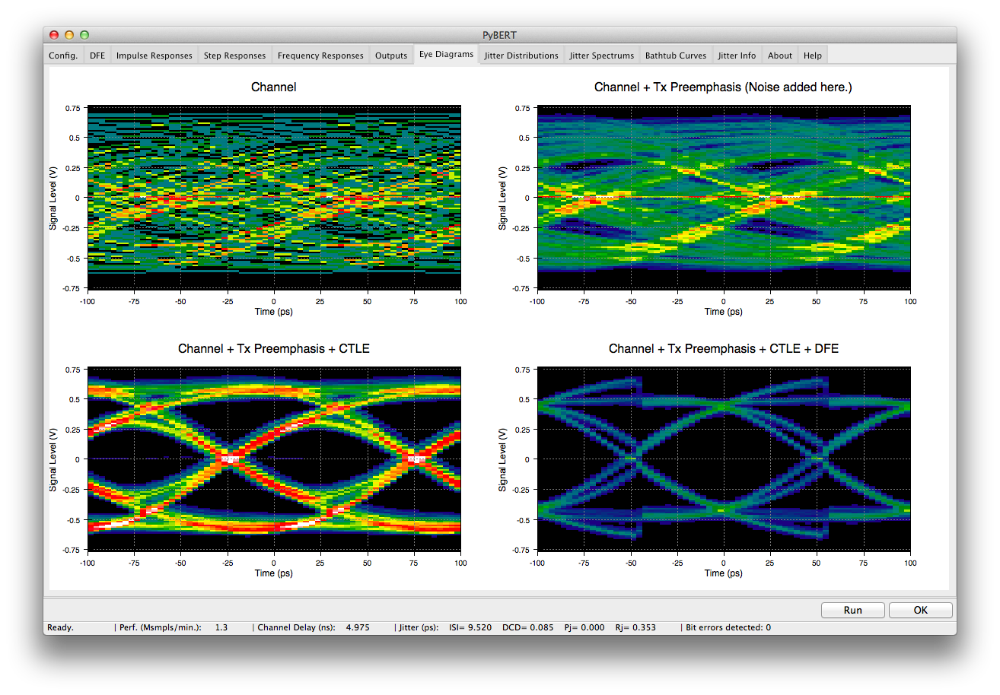

# PyBERT

PyBERT is a serial communication link bit error rate tester simulator with a graphical user interface (GUI).

Notice: Before using this package for any purpose, you MUST read and understand the terms put forward in the accompanying "LICENSE" file.

## Installation
- <https://github.com/capn-freako/PyBERT/wiki/instant_gratification>

## Testing
Tox is used for testing, linting and building the documentation.
* `pip install tox` or `conda install tox`
* `tox`

To run a single environment such as "docs" run: `tox -e docs`.  You can list all the envs with `tox --listenvs-all`

## Documentation
PyBERT documentation exists in 2 separate forms:

- For developers: 
  - pybert/doc/build/html/index.html  (See testing on how to build the documentation)

- For users:

  - Quick installation instructions at <https://github.com/capn-freako/PyBERT/wiki/instant_gratification>
  - The 'Help' tab of the PyBERT GUI
  - The PyBERT FAQ at <https://github.com/capn-freako/PyBERT/wiki/pybert_faq>
  - Sending e-mail to David Banas at <capn.freako@gmail.com>

## Acknowledgements

I would like to thank the following individuals, for their contributions to PyBERT:  

- Mark Marlett  
- Low Kian Seong  
- Amanda Bukur
- David Patterson
